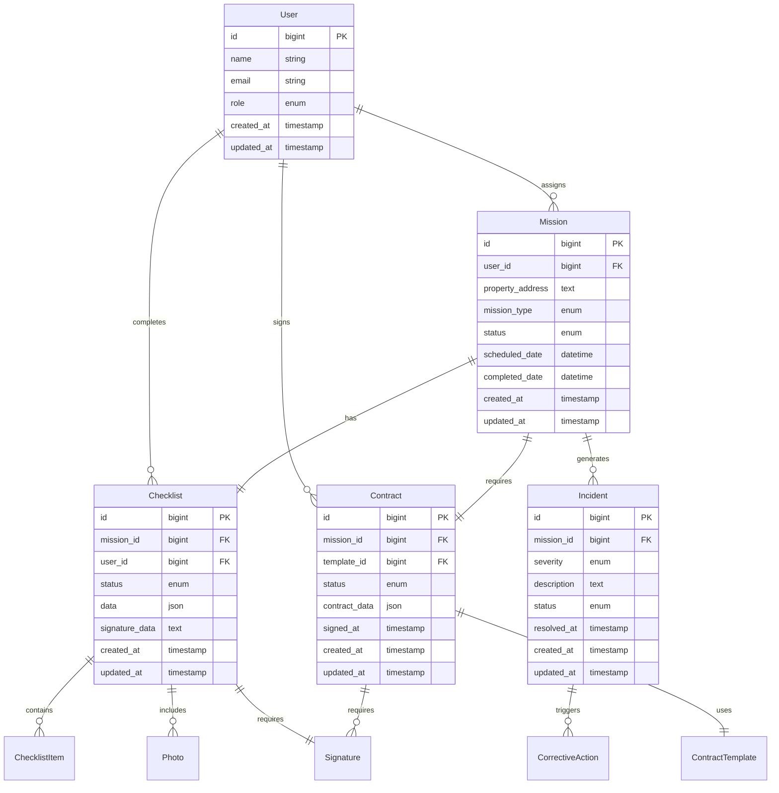

# Platform Rebuild Design Document

## Overview

This design document outlines the technical architecture for rebuilding the Baux Mobilité management platform using a server-side rendered approach with Laravel 11.x, Blade templates, and modern CSS frameworks. The rebuild will maintain all existing functionality while improving performance, maintainability, and user experience through a more traditional web application architecture.

## Architecture

### High-Level Architecture

```
┌─────────────────────────────────────────────────────────────┐
│                    Client Layer                             │
│  ┌─────────────────┐  ┌─────────────────┐  ┌──────────────┐ │
│  │   Web Browser   │  │  Mobile Browser │  │  PWA Client  │ │
│  └─────────────────┘  └─────────────────┘  └──────────────┘ │
└─────────────────────────────────────────────────────────────┘
                              │
                              ▼
┌─────────────────────────────────────────────────────────────┐
│                 Presentation Layer                          │
│  ┌─────────────────────────────────────────────────────────┐ │
│  │           Laravel Blade Templates                       │ │
│  │  ┌─────────────┐ ┌─────────────┐ ┌─────────────────────┐ │ │
│  │  │ Tailwind CSS│ │  Flowbite   │ │ Tailwind Elements   │ │ │
│  │  └─────────────┘ └─────────────┘ └─────────────────────┘ │ │
│  │  ┌─────────────────────────────────────────────────────┐ │ │
│  │  │              Alpine.js                              │ │ │
│  │  └─────────────────────────────────────────────────────┘ │ │
│  └─────────────────────────────────────────────────────────┘ │
└─────────────────────────────────────────────────────────────┘
                              │
                              ▼
┌─────────────────────────────────────────────────────────────┐
│                 Application Layer                           │
│  ┌─────────────────────────────────────────────────────────┐ │
│  │              Laravel 11.x Framework                     │ │
│  │  ┌─────────────┐ ┌─────────────┐ ┌─────────────────────┐ │ │
│  │  │ Controllers │ │ Middleware  │ │     Services        │ │ │
│  │  └─────────────┘ └─────────────┘ └─────────────────────┘ │ │
│  │  ┌─────────────┐ ┌─────────────┐ ┌─────────────────────┐ │ │
│  │  │   Models    │ │   Events    │ │   Notifications     │ │ │
│  │  └─────────────┘ └─────────────┘ └─────────────────────┘ │ │
│  └─────────────────────────────────────────────────────────┘ │
└─────────────────────────────────────────────────────────────┘
                              │
                              ▼
┌─────────────────────────────────────────────────────────────┐
│                   Data Layer                                │
│  ┌─────────────────┐ ┌─────────────────┐ ┌──────────────────┐ │
│  │     SQLite      │ │      MySQL      │ │     MariaDB      │ │
│  └─────────────────┘ └─────────────────┘ └──────────────────┘ │
└─────────────────────────────────────────────────────────────┘
```

### Frontend Architecture Transition

The rebuild will transition from the current Vue.js/Inertia.js SPA to a server-side rendered architecture:

**Current Architecture:**
- Laravel API + Vue.js SPA with Inertia.js
- Client-side routing and state management
- JSON API responses

**New Architecture:**
- Laravel with Blade templates
- Server-side rendering with progressive enhancement
- Alpine.js for interactive components
- Traditional form submissions with AJAX enhancements

## Components and Interfaces

### Frontend Component Structure

```
resources/views/
├── layouts/
│   ├── app.blade.php              # Main application layout
│   ├── auth.blade.php             # Authentication layout
│   └── components/
│       ├── navigation.blade.php   # Main navigation component
│       ├── sidebar.blade.php      # Dashboard sidebar
│       └── mobile-nav.blade.php   # Mobile navigation
├── components/
│   ├── ui/                        # Reusable UI components
│   │   ├── button.blade.php
│   │   ├── modal.blade.php
│   │   ├── card.blade.php
│   │   └── form-elements/
│   ├── mission/                   # Mission-specific components
│   │   ├── mission-card.blade.php
│   │   ├── mission-form.blade.php
│   │   └── mission-calendar.blade.php
│   ├── checklist/                 # Checklist components
│   │   ├── checklist-form.blade.php
│   │   ├── photo-uploader.blade.php
│   │   └── signature-pad.blade.php
│   └── analytics/                 # Analytics components
│       ├── stats-grid.blade.php
│       └── chart-container.blade.php
├── pages/
│   ├── dashboard/
│   ├── missions/
│   ├── checklists/
│   ├── contracts/
│   ├── incidents/
│   └── admin/
└── auth/
    ├── login.blade.php
    ├── register.blade.php
    └── forgot-password.blade.php
```

### CSS Framework Integration

**Tailwind CSS Configuration:**
```javascript
// tailwind.config.js
module.exports = {
  content: [
    './resources/**/*.blade.php',
    './resources/**/*.js',
    './node_modules/flowbite/**/*.js'
  ],
  theme: {
    extend: {
      colors: {
        primary: {
          50: '#eff6ff',
          500: '#3b82f6',
          600: '#2563eb',
          700: '#1d4ed8',
          800: '#1e40af',
          900: '#1e3a8a',
        }
      }
    }
  },
  plugins: [
    require('@tailwindcss/forms'),
    require('flowbite/plugin')
  ]
}
```

**Component Library Integration:**
- **Flowbite**: Primary component library for common UI elements (buttons, modals, dropdowns, forms)
- **Tailwind Elements**: Advanced components for complex interactions (datatables, charts, calendars)
- **Alpine.js**: Client-side interactivity for dynamic behaviors

### Backend Service Architecture

```
app/
├── Http/
│   ├── Controllers/
│   │   ├── DashboardController.php
│   │   ├── MissionController.php
│   │   ├── ChecklistController.php
│   │   ├── ContractController.php
│   │   ├── IncidentController.php
│   │   └── Api/                   # API endpoints for AJAX requests
│   ├── Middleware/
│   │   ├── RoleMiddleware.php
│   │   ├── AuditMiddleware.php
│   │   └── SecurityMiddleware.php
│   └── Requests/
│       ├── MissionRequest.php
│       ├── ChecklistRequest.php
│       └── ContractRequest.php
├── Services/
│   ├── MissionService.php
│   ├── ChecklistService.php
│   ├── ContractService.php
│   ├── NotificationService.php
│   ├── AnalyticsService.php
│   └── SecurityService.php
├── Models/
│   ├── User.php
│   ├── Mission.php
│   ├── Checklist.php
│   ├── Contract.php
│   ├── Incident.php
│   └── AuditLog.php
└── Events/
    ├── MissionAssigned.php
    ├── ChecklistCompleted.php
    └── IncidentDetected.php
```

## Data Models

### Core Entity Relationships



### Database Schema Design

**Key Design Principles:**
1. **Normalization**: Proper table relationships to avoid data duplication
2. **Indexing**: Strategic indexes on frequently queried columns
3. **JSON Storage**: Flexible data storage for dynamic form fields
4. **Audit Trail**: Comprehensive logging of all user actions
5. **Soft Deletes**: Maintain data integrity with soft deletion

**Migration Strategy:**
1. Create new optimized table structures
2. Migrate existing data with transformation scripts
3. Update foreign key relationships
4. Add new indexes for performance
5. Implement data validation rules

## Error Handling

### Frontend Error Handling

**Blade Template Error Handling:**
```php
// resources/views/components/error-boundary.blade.php
@if($errors->any())
    <div class="bg-red-50 border border-red-200 rounded-md p-4 mb-4">
        <div class="flex">
            <div class="flex-shrink-0">
                <svg class="h-5 w-5 text-red-400" viewBox="0 0 20 20" fill="currentColor">
                    <path fill-rule="evenodd" d="M10 18a8 8 0 100-16 8 8 0 000 16zM8.707 7.293a1 1 0 00-1.414 1.414L8.586 10l-1.293 1.293a1 1 0 101.414 1.414L10 11.414l1.293 1.293a1 1 0 001.414-1.414L11.414 10l1.293-1.293a1 1 0 00-1.414-1.414L10 8.586 8.707 7.293z" clip-rule="evenodd" />
                </svg>
            </div>
            <div class="ml-3">
                <h3 class="text-sm font-medium text-red-800">
                    There were errors with your submission
                </h3>
                <div class="mt-2 text-sm text-red-700">
                    <ul class="list-disc pl-5 space-y-1">
                        @foreach($errors->all() as $error)
                            <li>{{ $error }}</li>
                        @endforeach
                    </ul>
                </div>
            </div>
        </div>
    </div>
@endif
```

**Alpine.js Error Handling:**
```javascript
// resources/js/error-handler.js
window.Alpine.data('errorHandler', () => ({
    errors: {},
    showError(field, message) {
        this.errors[field] = message;
        setTimeout(() => {
            delete this.errors[field];
        }, 5000);
    },
    clearErrors() {
        this.errors = {};
    }
}));
```

### Backend Error Handling

**Custom Exception Handler:**
```php
// app/Exceptions/Handler.php
public function render($request, Throwable $exception)
{
    if ($request->expectsJson()) {
        return response()->json([
            'error' => $exception->getMessage(),
            'code' => $exception->getCode()
        ], 500);
    }

    if ($exception instanceof ValidationException) {
        return back()->withErrors($exception->errors())->withInput();
    }

    return parent::render($request, $exception);
}
```

**Service Layer Error Handling:**
```php
// app/Services/BaseService.php
abstract class BaseService
{
    protected function handleException(\Throwable $e, string $operation): void
    {
        Log::error("Error in {$operation}: " . $e->getMessage(), [
            'exception' => $e,
            'user_id' => auth()->id(),
            'timestamp' => now()
        ]);
        
        throw new ServiceException("Failed to {$operation}: " . $e->getMessage());
    }
}
```

## Testing Strategy

### Frontend Testing

**Blade Component Testing:**
```php
// tests/Feature/BladeComponentTest.php
class BladeComponentTest extends TestCase
{
    public function test_mission_card_renders_correctly()
    {
        $mission = Mission::factory()->create();
        
        $view = $this->blade('<x-mission.mission-card :mission="$mission" />', [
            'mission' => $mission
        ]);
        
        $view->assertSee($mission->property_address);
        $view->assertSee($mission->status);
    }
}
```

**Alpine.js Integration Testing:**
```javascript
// tests/js/alpine-components.test.js
import { Alpine } from 'alpinejs';

describe('Alpine.js Components', () => {
    test('mission form validation works', async () => {
        document.body.innerHTML = `
            <div x-data="missionForm()">
                <input x-model="form.address" type="text" />
                <span x-show="errors.address" x-text="errors.address"></span>
            </div>
        `;
        
        Alpine.start();
        
        // Test validation logic
        const input = document.querySelector('input');
        input.value = '';
        input.dispatchEvent(new Event('blur'));
        
        expect(document.querySelector('span').textContent).toBe('Address is required');
    });
});
```

### Backend Testing

**Feature Testing:**
```php
// tests/Feature/MissionWorkflowTest.php
class MissionWorkflowTest extends TestCase
{
    public function test_complete_mission_workflow()
    {
        $user = User::factory()->create(['role' => 'ops']);
        $agent = User::factory()->create(['role' => 'controller']);
        
        // Create mission
        $response = $this->actingAs($user)->post('/missions', [
            'property_address' => '123 Test Street',
            'mission_type' => 'entry',
            'assigned_agent_id' => $agent->id
        ]);
        
        $response->assertRedirect();
        $this->assertDatabaseHas('missions', [
            'property_address' => '123 Test Street'
        ]);
        
        // Complete checklist
        $mission = Mission::latest()->first();
        $this->actingAs($agent)->post("/checklists/{$mission->id}", [
            'items' => ['item1' => 'good', 'item2' => 'fair'],
            'signature' => 'base64_signature_data'
        ]);
        
        $this->assertDatabaseHas('checklists', [
            'mission_id' => $mission->id,
            'status' => 'completed'
        ]);
    }
}
```

### Performance Testing

**Load Testing Strategy:**
1. **Page Load Performance**: Target < 2 seconds for initial page load
2. **Database Query Optimization**: Monitor N+1 queries and implement eager loading
3. **Caching Strategy**: Implement Redis caching for frequently accessed data
4. **Asset Optimization**: Minify CSS/JS and implement CDN for static assets

## Security Considerations

### Authentication and Authorization

**Multi-Factor Authentication:**
```php
// app/Http/Middleware/RequireMFA.php
class RequireMFA
{
    public function handle($request, Closure $next)
    {
        if (auth()->user()->requires_mfa && !session('mfa_verified')) {
            return redirect()->route('mfa.verify');
        }
        
        return $next($request);
    }
}
```

**Role-Based Access Control:**
```php
// app/Policies/MissionPolicy.php
class MissionPolicy
{
    public function view(User $user, Mission $mission)
    {
        return $user->hasRole('admin') || 
               $user->hasRole('ops') || 
               $mission->assigned_agent_id === $user->id;
    }
    
    public function update(User $user, Mission $mission)
    {
        return $user->hasRole('ops') || 
               ($user->hasRole('controller') && $mission->assigned_agent_id === $user->id);
    }
}
```

### Data Protection

**Encryption Strategy:**
```php
// app/Services/EncryptionService.php
class EncryptionService
{
    public function encryptSensitiveData(array $data): string
    {
        return encrypt(json_encode($data));
    }
    
    public function decryptSensitiveData(string $encryptedData): array
    {
        return json_decode(decrypt($encryptedData), true);
    }
}
```

**Audit Logging:**
```php
// app/Observers/AuditObserver.php
class AuditObserver
{
    public function created($model)
    {
        AuditLog::create([
            'user_id' => auth()->id(),
            'action' => 'created',
            'model_type' => get_class($model),
            'model_id' => $model->id,
            'changes' => $model->toArray()
        ]);
    }
}
```

## Deployment Strategy

### Environment Configuration

**Production Environment:**
- PHP 8.2+ with OPcache enabled
- MySQL 8.0 or MariaDB 10.6+
- Redis for caching and sessions
- Nginx with SSL termination
- Supervisor for queue workers

**Staging Environment:**
- Mirror production configuration
- Automated testing pipeline
- Database seeding with test data

### Migration Plan

**Phase 1: Backend Preparation**
1. Set up new Laravel 11.x installation
2. Migrate database schema with optimizations
3. Implement core services and models
4. Set up authentication and authorization

**Phase 2: Frontend Rebuild**
1. Create Blade template structure
2. Implement Tailwind CSS with Flowbite components
3. Add Alpine.js interactivity
4. Migrate existing functionality page by page

**Phase 3: Testing and Optimization**
1. Comprehensive testing of all features
2. Performance optimization and caching
3. Security audit and penetration testing
4. User acceptance testing

**Phase 4: Deployment and Monitoring**
1. Blue-green deployment strategy
2. Database migration with rollback plan
3. Monitoring and alerting setup
4. User training and documentation

This design provides a comprehensive foundation for rebuilding the platform while maintaining all existing functionality and improving performance, maintainability, and user experience.