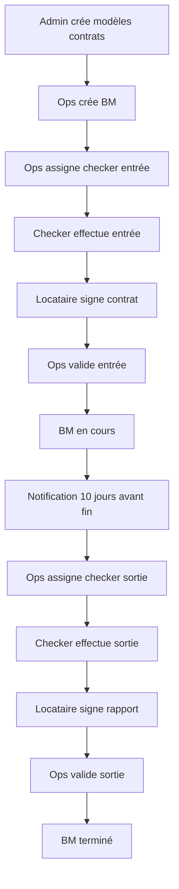

# Guides d'Utilisation - Système Ops et Bail Mobilité

## Vue d'ensemble

Cette section contient les guides d'utilisation détaillés pour chaque rôle utilisateur du système.

## Guides Disponibles

### 1. [Guide Administrateur](./admin-guide.md)
Guide complet pour les super-administrateurs :
- Gestion des utilisateurs et rôles
- Configuration des modèles de contrats
- Signature des modèles de contrats
- Supervision générale du système

### 2. [Guide Utilisateur Ops](./ops-guide.md)
Guide détaillé pour les utilisateurs Ops :
- Création et gestion des Bail Mobilité
- Assignation des checkers
- Validation des checklists
- Gestion des incidents
- Utilisation du tableau de bord et kanban

### 3. [Guide Checker](./checker-guide.md)
Guide pratique pour les checkers :
- Exécution des missions d'entrée et sortie
- Remplissage des checklists avec photos
- Processus de signature électronique
- Gestion des cas particuliers

## Workflow Général

## Rôles et Permissions

### Super Admin
- **Permissions complètes** sur tout le système
- **Gestion des utilisateurs** et attribution des rôles
- **Configuration** des modèles de contrats
- **Signature** des modèles de contrats
- **Supervision** de toutes les activités

### Ops (Opérations)
- **Création et gestion** des Bail Mobilité
- **Assignation** des checkers aux missions
- **Validation** des checklists d'entrée et sortie
- **Gestion** des incidents et actions correctives
- **Accès** au tableau de bord opérationnel
- **Consultation** des contrats signés

### Checker
- **Exécution** des missions assignées
- **Remplissage** des checklists avec photos
- **Facilitation** des signatures électroniques
- **Signalement** des problèmes et incidents
- **Consultation** de ses missions et historique

## Statuts des Bail Mobilité

### Assigned (Assigné)
- BM créé avec missions générées
- En attente d'assignation du checker d'entrée
- **Actions possibles** : Assigner checker, modifier dates

### In Progress (En cours)
- Entrée validée par les Ops
- Locataire en séjour
- **Actions possibles** : Modifier date fin, préparer sortie

### Completed (Terminé)
- Sortie validée avec succès
- Clés récupérées, contrats signés
- **Actions possibles** : Consultation, archivage

### Incident
- Problème détecté (clés non remises, checklist incomplète)
- Nécessite intervention
- **Actions possibles** : Actions correctives, résolution

## Types de Notifications

### Pour les Ops
- **Checklist à valider** : Entrée ou sortie soumise
- **Incident détecté** : Problème automatiquement identifié
- **Rappel sortie** : 10 jours avant fin de séjour
- **Action corrective** : Mise à jour sur incident

### Pour les Checkers
- **Mission assignée** : Nouvelle mission d'entrée ou sortie
- **Modification horaire** : Changement de rendez-vous
- **Information BM** : Détails importants du séjour

## Processus de Signature Électronique

### Étapes
1. **Checker** présente le contrat sur tablette/smartphone
2. **Locataire** lit et signe électroniquement
3. **Système** capture signature + métadonnées (IP, device, timestamp)
4. **Génération** automatique du PDF avec signatures intégrées
5. **Stockage** sécurisé du document signé

### Métadonnées Capturées
- Date et heure de signature
- Adresse IP du device
- Informations du navigateur/device
- Géolocalisation (si autorisée)
- Référence au modèle de contrat utilisé

## Gestion des Photos

### Photos Obligatoires
- **Entrée** : État général, compteurs, équipements
- **Sortie** : État final, dégâts éventuels, propreté

### Bonnes Pratiques
- **Qualité** : Photos nettes et bien éclairées
- **Angles** : Plusieurs vues pour chaque élément
- **Horodatage** : Automatique via l'application
- **Stockage** : Sauvegarde automatique et sécurisée

## Support et Assistance

### En cas de problème
1. **Consulter** les guides de dépannage
2. **Vérifier** les logs d'erreur
3. **Contacter** l'équipe technique
4. **Documenter** le problème pour amélioration

### Contacts
- **Support technique** : support@example.com
- **Formation** : formation@example.com
- **Urgences** : +33 1 23 45 67 89