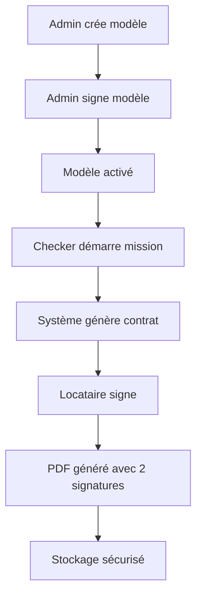

# Documentation - Processus de Signature Électronique

## Vue d'ensemble

Le système de signature électronique permet la création et la signature de contrats de bail mobilité de manière entièrement numérique, avec une valeur légale équivalente aux signatures manuscrites.

## Architecture du Système

### Composants Principaux

1. **Modèles de Contrats** : Templates pré-signés par l'administrateur
2. **Génération Dynamique** : Création de contrats personnalisés
3. **Signature Électronique** : Capture de signatures avec métadonnées
4. **Génération PDF** : Documents finaux avec signatures intégrées
5. **Stockage Sécurisé** : Archivage avec traçabilité complète

### Flux de Signature



## Types de Contrats

### Contrat d'Entrée
**Utilisation** : Signature lors de l'entrée du locataire
**Contenu** :
- Conditions générales du bail mobilité
- État des lieux d'entrée
- Droits et obligations du locataire
- Modalités de fin de séjour

### Contrat de Sortie
**Utilisation** : Signature lors de la sortie du locataire
**Contenu** :
- Rapport d'inspection de sortie
- État des lieux comparatif
- Restitution des clés
- Éventuelles retenues ou dégâts

## Processus de Création des Modèles

### 1. Création par l'Administrateur

```php
// Exemple de création de modèle
$template = ContractTemplate::create([
    'name' => 'Contrat d\'entrée standard 2025',
    'type' => 'entry',
    'content' => $legalContent,
    'created_by' => auth()->id()
]);
```

**Champs requis** :
- `name` : Nom descriptif du modèle
- `type` : 'entry' ou 'exit'
- `content` : Contenu légal du contrat
- `created_by` : ID de l'administrateur créateur

### 2. Signature par l'Administrateur

```php
// Processus de signature admin
$template->update([
    'admin_signature' => $signatureData,
    'admin_signed_at' => now(),
    'is_active' => true
]);
```

**Données de signature** :
- Signature électronique encodée en base64
- Timestamp de signature
- Activation automatique du modèle

### 3. Activation du Modèle

Un modèle n'est utilisable que s'il est :
- ✅ Signé par l'administrateur
- ✅ Marqué comme actif
- ✅ Du bon type (entry/exit)

## Génération Dynamique des Contrats

### Variables Dynamiques

Les modèles de contrats peuvent contenir des variables qui sont remplacées automatiquement :

```php
// Variables disponibles dans les modèles
$variables = [
    '{{tenant_name}}' => $bailMobilite->tenant_name,
    '{{tenant_email}}' => $bailMobilite->tenant_email,
    '{{tenant_phone}}' => $bailMobilite->tenant_phone,
    '{{address}}' => $bailMobilite->address,
    '{{start_date}}' => $bailMobilite->start_date->format('d/m/Y'),
    '{{end_date}}' => $bailMobilite->end_date->format('d/m/Y'),
    '{{current_date}}' => now()->format('d/m/Y'),
    '{{mission_date}}' => $mission->scheduled_date->format('d/m/Y')
];
```

### Exemple de Modèle

```html
<h1>CONTRAT DE BAIL MOBILITÉ</h1>

<p><strong>Locataire :</strong> {{tenant_name}}</p>
<p><strong>Email :</strong> {{tenant_email}}</p>
<p><strong>Téléphone :</strong> {{tenant_phone}}</p>

<p><strong>Logement :</strong> {{address}}</p>
<p><strong>Période :</strong> Du {{start_date}} au {{end_date}}</p>

<h2>CONDITIONS GÉNÉRALES</h2>
<p>Le présent contrat est établi pour une durée déterminée...</p>

<!-- Signature admin sera intégrée ici -->
<div class="signature-admin">
    <p>Signature de l'hôte :</p>
    <p>Date : {{admin_signed_date}}</p>
</div>

<!-- Zone de signature locataire -->
<div class="signature-tenant">
    <p>Signature du locataire :</p>
    <p>Date : {{tenant_signed_date}}</p>
</div>
```

## Processus de Signature Électronique

### 1. Préparation de la Signature

```javascript
// Côté frontend - Préparation du pad de signature
const signaturePad = new SignaturePad(canvas, {
    backgroundColor: 'rgb(255, 255, 255)',
    penColor: 'rgb(0, 0, 0)',
    minWidth: 1,
    maxWidth: 3
});
```

### 2. Capture de la Signature

```javascript
// Capture des données de signature
const signatureData = {
    signature: signaturePad.toDataURL('image/png'),
    metadata: {
        timestamp: new Date().toISOString(),
        ip_address: await getClientIP(),
        user_agent: navigator.userAgent,
        screen_resolution: `${screen.width}x${screen.height}`,
        device_type: getDeviceType()
    }
};
```

### 3. Validation Côté Serveur

```php
// Validation de la signature
public function validateSignature($signatureData)
{
    // Vérifier le format de la signature
    if (!preg_match('/^data:image\/png;base64,/', $signatureData['signature'])) {
        throw new InvalidSignatureException('Format de signature invalide');
    }
    
    // Vérifier la taille de l'image
    $imageSize = strlen(base64_decode(substr($signatureData['signature'], 22)));
    if ($imageSize > 500000) { // 500KB max
        throw new InvalidSignatureException('Signature trop volumineuse');
    }
    
    // Vérifier les métadonnées
    $requiredMetadata = ['timestamp', 'ip_address', 'user_agent'];
    foreach ($requiredMetadata as $field) {
        if (empty($signatureData['metadata'][$field])) {
            throw new InvalidSignatureException("Métadonnée manquante : $field");
        }
    }
    
    return true;
}
```

## Génération des PDF Signés

### Service de Génération

```php
class SignatureService
{
    public function generateSignedContract(BailMobilite $bailMobilite, string $signatureType)
    {
        // 1. Récupérer le modèle de contrat approprié
        $template = ContractTemplate::active()
            ->where('type', $signatureType)
            ->first();
            
        // 2. Remplacer les variables dynamiques
        $content = $this->replaceVariables($template->content, $bailMobilite);
        
        // 3. Intégrer les signatures
        $content = $this->integrateSignatures($content, $template, $bailMobilite, $signatureType);
        
        // 4. Générer le PDF
        $pdf = PDF::loadHTML($content);
        
        // 5. Sauvegarder le fichier
        $filename = $this->generateFilename($bailMobilite, $signatureType);
        $path = storage_path("app/contracts/{$filename}");
        $pdf->save($path);
        
        // 6. Enregistrer en base
        BailMobiliteSignature::create([
            'bail_mobilite_id' => $bailMobilite->id,
            'signature_type' => $signatureType,
            'contract_template_id' => $template->id,
            'tenant_signature' => $tenantSignature,
            'tenant_signed_at' => now(),
            'contract_pdf_path' => $filename
        ]);
        
        return $path;
    }
}
```

### Intégration des Signatures

```php
private function integrateSignatures($content, $template, $bailMobilite, $signatureType)
{
    // Signature de l'administrateur
    $adminSignatureHtml = sprintf(
        '',
        base64_encode($template->admin_signature)
    );
    
    // Signature du locataire
    $tenantSignature = $bailMobilite->signatures()
        ->where('signature_type', $signatureType)
        ->first();
        
    $tenantSignatureHtml = sprintf(
        '',
        base64_encode($tenantSignature->tenant_signature)
    );
    
    // Remplacement dans le contenu
    $content = str_replace('{{admin_signature}}', $adminSignatureHtml, $content);
    $content = str_replace('{{tenant_signature}}', $tenantSignatureHtml, $content);
    $content = str_replace('{{admin_signed_date}}', $template->admin_signed_at->format('d/m/Y H:i'), $content);
    $content = str_replace('{{tenant_signed_date}}', $tenantSignature->tenant_signed_at->format('d/m/Y H:i'), $content);
    
    return $content;
}
```

## Métadonnées de Signature

### Données Capturées

Pour chaque signature électronique, le système capture :

```php
$metadata = [
    'timestamp' => '2025-01-09T14:30:25.123Z',
    'ip_address' => '192.168.1.100',
    'user_agent' => 'Mozilla/5.0 (iPhone; CPU iPhone OS 15_0 like Mac OS X)...',
    'screen_resolution' => '390x844',
    'device_type' => 'mobile',
    'geolocation' => [
        'latitude' => 48.8566,
        'longitude' => 2.3522,
        'accuracy' => 10
    ],
    'session_id' => 'sess_abc123def456',
    'mission_id' => 123,
    'checker_id' => 45
];
```

### Stockage des Métadonnées

```php
// Migration pour ajouter les métadonnées
Schema::table('bail_mobilite_signatures', function (Blueprint $table) {
    $table->json('signature_metadata')->nullable();
    $table->string('ip_address')->nullable();
    $table->text('user_agent')->nullable();
    $table->string('device_type')->nullable();
    $table->decimal('latitude', 10, 8)->nullable();
    $table->decimal('longitude', 11, 8)->nullable();
});
```

## Sécurité et Conformité Légale

### Mesures de Sécurité

1. **Chiffrement** : Signatures stockées avec chiffrement AES-256
2. **Intégrité** : Hash SHA-256 de chaque signature
3. **Traçabilité** : Logs complets de toutes les actions
4. **Accès** : Contrôle strict des permissions
5. **Sauvegarde** : Copies sécurisées automatiques

### Conformité RGPD

- **Consentement** : Signature implique consentement au traitement
- **Finalité** : Données utilisées uniquement pour le contrat
- **Durée** : Conservation selon obligations légales
- **Droits** : Accès, rectification, suppression sur demande

### Valeur Légale

Les signatures électroniques respectent :
- **Règlement eIDAS** européen
- **Code civil français** (articles 1366 et suivants)
- **Identification** : Métadonnées permettent l'identification
- **Intégrité** : Hash garantit la non-modification
- **Non-répudiation** : Traçabilité complète des actions

## API de Signature

### Endpoints Principaux

#### POST /signatures/tenant-sign
Signature par le locataire

```json
{
  "bail_mobilite_id": 123,
  "signature_type": "entry",
  "signature": "data:image/png;base64,iVBORw0KGgoAAAANSUhEUgAA...",
  "metadata": {
    "ip_address": "192.168.1.100",
    "user_agent": "Mozilla/5.0...",
    "device_type": "mobile",
    "geolocation": {
      "latitude": 48.8566,
      "longitude": 2.3522
    }
  }
}
```

#### GET /signatures/{id}/verify
Vérification d'une signature

```json
{
  "valid": true,
  "signature_date": "2025-01-09T14:30:25Z",
  "signer": "Jean Dupont",
  "document_hash": "sha256:abc123...",
  "metadata": {
    "ip_address": "192.168.1.100",
    "device_type": "mobile"
  }
}
```

## Dépannage

### Problèmes Courants

#### Signature ne s'affiche pas
**Causes possibles** :
- Problème de réseau
- Signature corrompue
- Permissions insuffisantes

**Solutions** :
1. Vérifier la connexion internet
2. Recharger la page
3. Vider le cache du navigateur
4. Contacter le support technique

#### PDF ne se génère pas
**Causes possibles** :
- Modèle de contrat inactif
- Signature manquante
- Erreur de template

**Solutions** :
1. Vérifier que le modèle est signé et actif
2. S'assurer que toutes les signatures sont présentes
3. Vérifier les logs d'erreur
4. Régénérer le PDF manuellement

#### Métadonnées manquantes
**Causes possibles** :
- JavaScript désactivé
- Permissions géolocalisation refusées
- Navigateur non compatible

**Solutions** :
1. Activer JavaScript
2. Autoriser la géolocalisation
3. Utiliser un navigateur récent
4. Capturer les métadonnées manuellement

## Maintenance

### Tâches Régulières

1. **Vérification intégrité** : Contrôle des hash de signatures
2. **Nettoyage** : Suppression des fichiers temporaires
3. **Archivage** : Déplacement des anciens contrats
4. **Sauvegarde** : Backup des signatures et métadonnées

### Monitoring

- **Taux de réussite** des signatures
- **Temps de génération** des PDF
- **Erreurs** de validation
- **Utilisation** de l'espace de stockage

### Évolutions Futures

- **Signature biométrique** : Reconnaissance vocale/faciale
- **Blockchain** : Horodatage distribué
- **IA** : Détection de fraude automatique
- **Multi-signature** : Signatures multiples simultanées